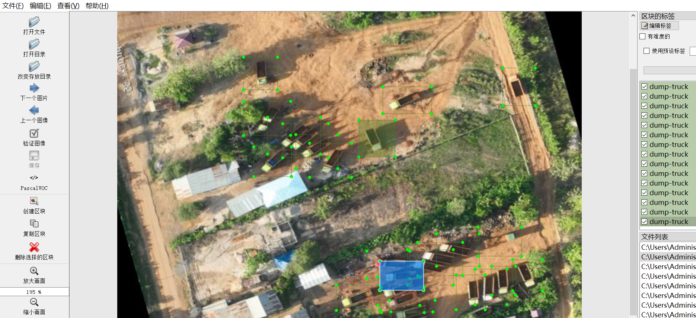
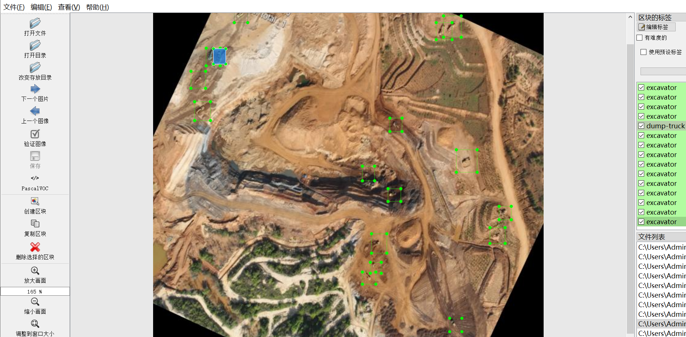
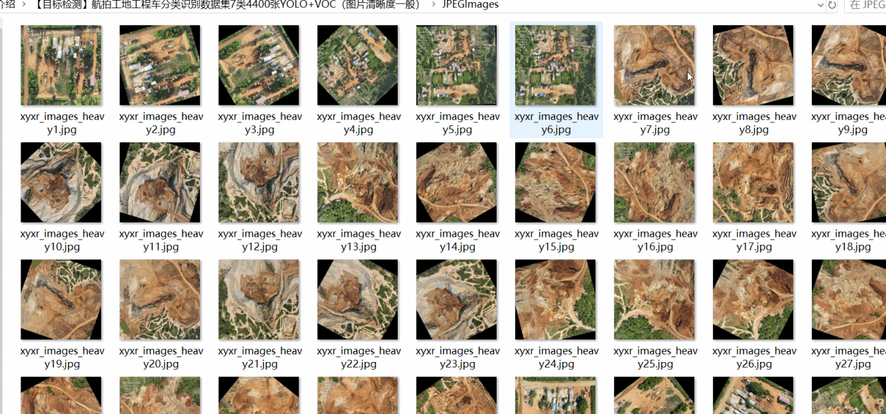
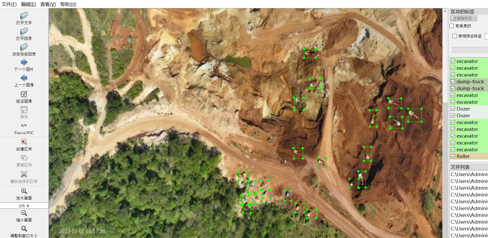

# Object Detection
Aerial Construction Site Engineering Vehicle Classification Recognition Dataset - 7-class - 4400 Images - YOLO+VOC

【Object Detection】Aerial Photo Classification Dataset for Construction Machinery - 7 Classes - 4400 Images - YOLO+VOC

Dataset format: VOC format + YOLO format

Compressed package contains: 3 folders, respectively storing the images, xml, and txt files

In the JPEGImages folder, there are a total of 4424 jpg images.

In the Annotations folder, there are a total of 4424 xml files.

In the labels folder, there are a total of 4424 txt files.

Number of label types: 7

Label names: ["Dozer", "Roller", "dump-truck", "excavator", "fuel-truck", "grader", "truck"]

The number of bounding boxes (Note that the order of categories in the YOLO format does not correspond to this, but is based on the classes.txt file in the labels folder):

Dozer bounding box count = 4804

Roller bounding box count = 256

dump-truck bounding box count = 52147

excavator bounding box count = 42398

fuel-truck bounding box count = 335

grader bounding box count = 150

truck bounding box count = 10

Total bounding box count = 100100

Image clarity (resolution: pixels): Generally good, with some blur due to long distance from the camera and some distortion

Image enhancement: Yes

Label shape: Rectangular boxes for target detection recognition

Important note: The image clarity is generally good, but some blur due to long distance from the camera and some distortion.

Special declaration: This dataset does not guarantee the accuracy or weight files of trained models, only accurate and reasonable annotations are provided.

Data set type: 119m

Annotation situation:

Image overview:
## Images

---

Here is a pay link on Stripe (https://buy.stripe.com/3cs8yP7sY87d0vu9AB). Please contact me lonlonago@foxmail.com after funding $89, and I will send you a complete data files, thank you!

